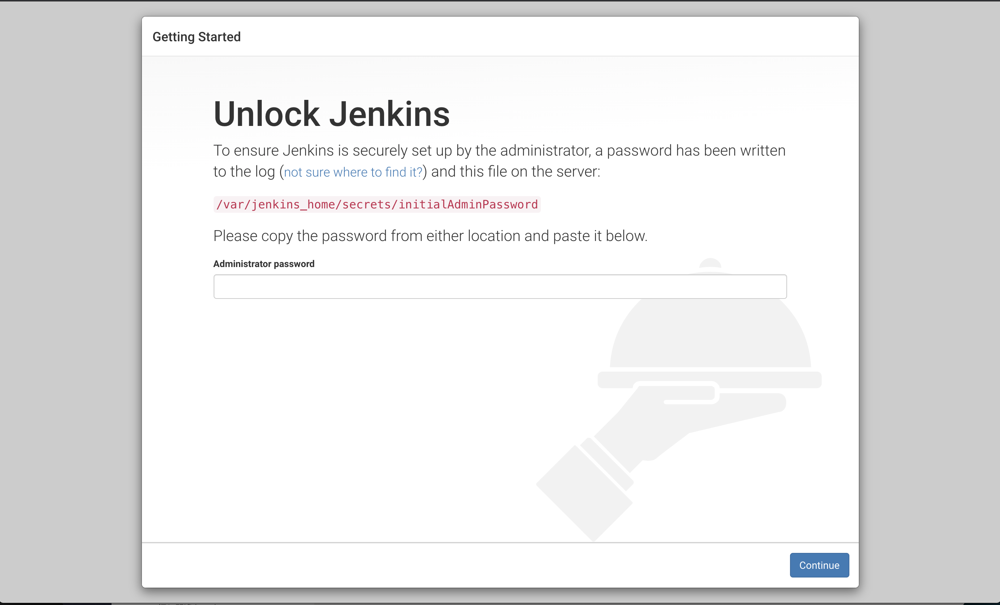
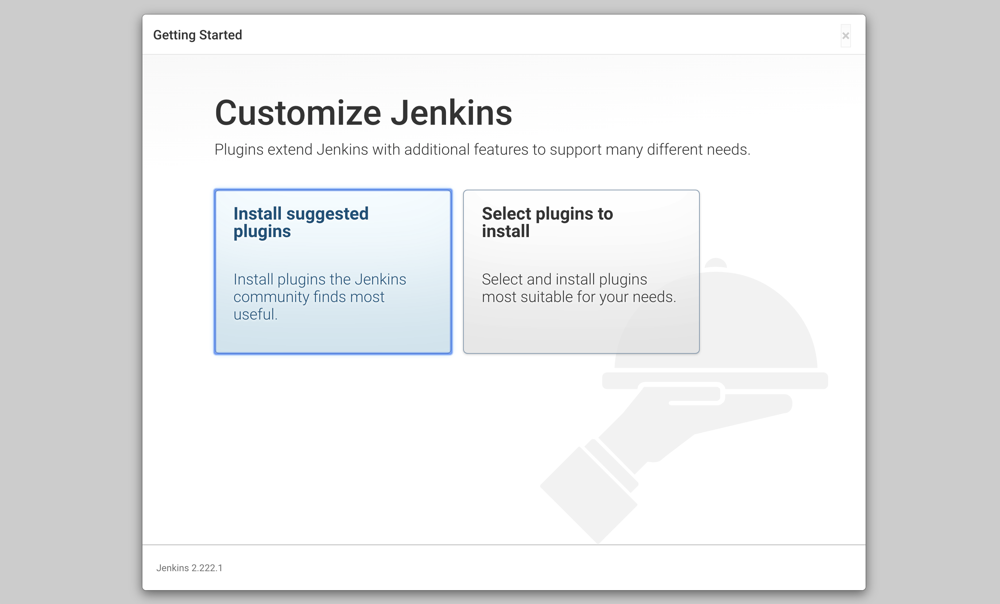
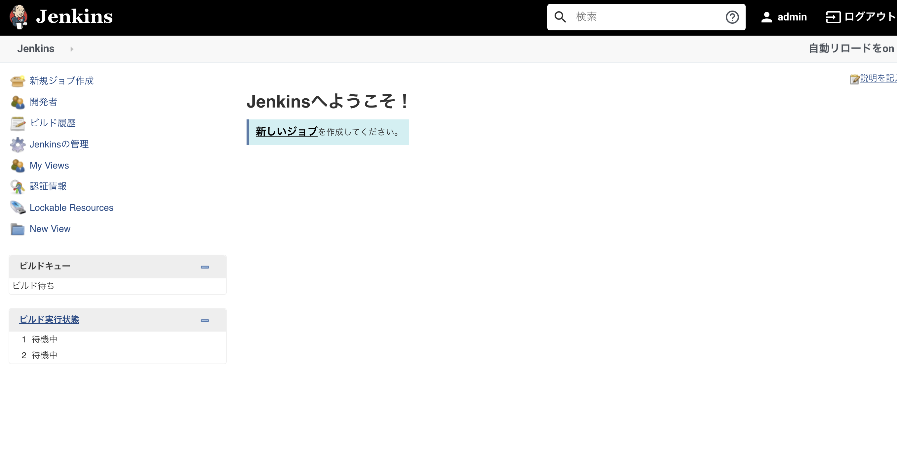
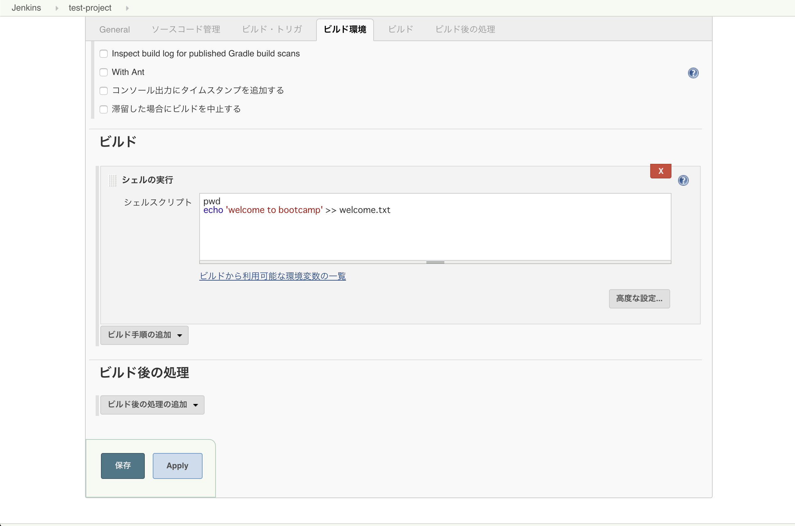
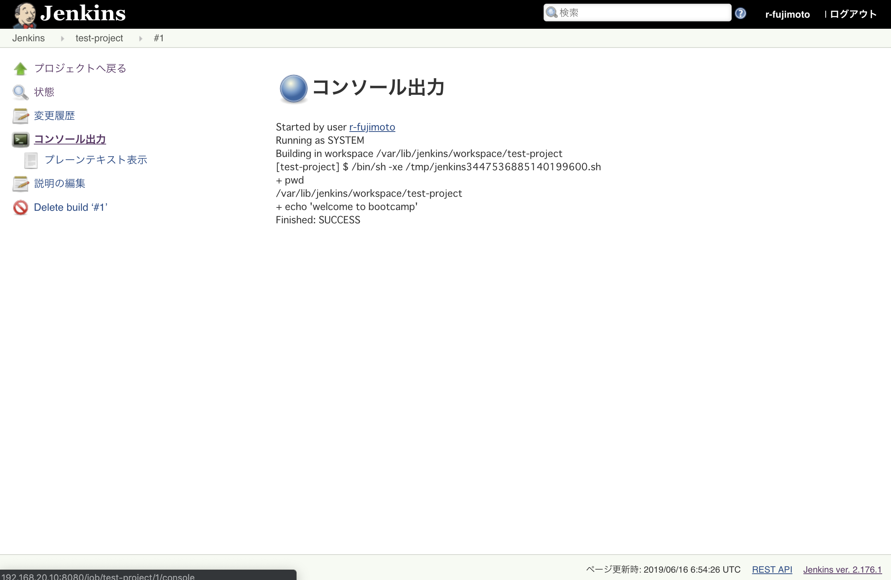
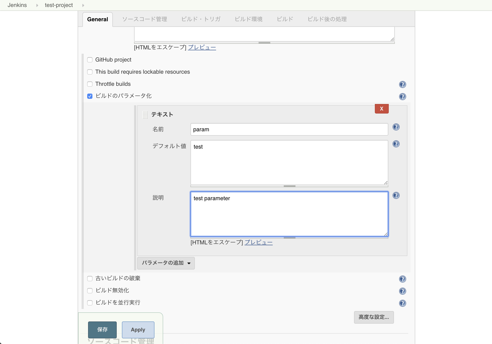

# Jenkins を触ってみよう

## 事前準備

この講義では jenkins を試しに触るため、docker で手元に jenkins を構築します。
イメージのダウンロードに時間がかかる可能性があるので、pull だけ済ませておいてください。

```
docker pull jenkins/jenkins:lts
```

## jenkins とは

2011 年に発表された CI(継続的インテグレーション) / CD（継続的デリバリー）ツールの１つで、シェルスクリプトで作成されたタスクを URL へのリクエストや時刻を指定した定期実行、他のタスクからのチェインなど様々なトリガーで実行することができるツールです。

CI とは、開発中にコミットや push の度にテストやデプロイを「継続的に」実施することで、問題の発見を早期に発見する開発手法です。
例えば１ヶ月開発してからデプロイ・テストをするよりも、1 日に一回や変更の度にテストを回す方が効率的に問題を発見できます。
当然これは単体テストや自動でデプロイを行う仕組みを作っていることが前提です。

CI ツールはそのような開発スタイルをサポートするためのツールで、github の commit などをトリガーにしてテストやデプロイを実施して結果を知らせてくれるツールの総称です。

最近の主要な CI ツールとしては

- jenkins
- Circle CI
- Travis CI
- drone.io

あたりが上げられます。

jenkins の特徴としては、タスクの実行内容をシェルスクリプトで作成するためシンプルで自由度が高く、様々な用途に使用することができます。
（向き不向きはあれど jenkins があればほぼなんでもできる）

またプラグインで機能を拡張することができる他、master と slave 構成にしてスケールさせることも可能です。

欠点としてはタスクのスクリプトは jenkins が構築されている環境で実行されるため、例えば ruby を実行したければ jenkins が動作しているホストに ruby をインストールする必要があります。これは例えば、プロジェクトによって違う ruby のバージョンを使いたくなったときなどに非常に辛いです。

このあたりは Circle CI や done.io などのコンテナ型ツールの方が便利です。ただし jenkins プラグインの中にはタスクをコンテナで実行するためのプラグインもあるため、やろうと思えば jenkins をコンテナ対応させることも可能です。

## jenkins を立ち上げてみる

jenkins を試しに触るため、docker を使って手元に構築してみましょう。
社内に供用で使える jenkins サーバが立っていればそちらを使うこともできます。講師の指示に従ってください。

docker の使える環境で以下のコマンドを実行して、jenkins を実行してください。

```bash
mkdir jenkins
docker run -p 8080:8080 -p 50000:50000 --mount type=bind,source=%CD%¥jenkins,target=/var/jenkins_home,ro jenkins/jenkins:lts
```

途中で以下のように初期パスワードが表示されるため、コピペしておきましょう。

```
*************************************************************
*************************************************************
*************************************************************

Jenkins initial setup is required. An admin user has been created and a password generated.
Please use the following password to proceed to installation:

050703f1fa114304839a65244184d222 <- 初期パスワードの例

This may also be found at: /var/jenkins_home/secrets/initialAdminPassword

*************************************************************
*************************************************************
*************************************************************
```

`Jenkins is fully up and running` と表示されたら成功です。 `localhost:8080` をブラウザで開いてみてください。以下のような画面が表示されると思います。



先ほどコピペしたパスワードを入力して「Continue」を押しましょう。すると次の画面が表示されます。



「Install suggested plugins」を選んでください。すると plugin のインストールが自動的に始まります。plugin のインストールが終わると以下の画面が表示されるので、適当に入力しましょう。


最終的に「Jenkins へようこそ！」と表示されれば成功です。



## jenkins を使ってみよう

早速試しに使ってみましょう。「新しいジョブを作成」をクリックするとジョブの作成画面に入ります。まずは「フリースタイル・プロジェクトのビルド」をクリックしてください。


作成するとジョブの設定画面が開きます。色々設定がありますが、まずは「ビルド」からスクリプトを登録してみましょう。「ビルド手順の追加」から「シェルの実行」を選ぶとスクリプトを登録できます。



「保存」をクリックするとジョブが作成されるので、「ビルド実行」を押して実行してみます。
「ビルド履歴」に`#1`が増えたでしょうか。`#1`をクリックして「コンソール出力」をクリックするとビルドの様子を確認できます。



## ワークスペース

上の例ではシェルスクリプトで`welcome.txt`というファイルを作成しました。このようにビルドの実行で生成されるファイルを「成果物」と呼んだりします。今回は適当なテキストファイルでしたが、ビルドした結果生成されたバイナリファイルであることが多いです。

成果物はどこに作られているでしょうか。jenkins ホストで以下のディレクトリを覗くと成果物が生成されているのが分かります。

```bash
$ cat /var/lib/jenkins/workspace/test-project/welcome.txt
welcome to bootcamp
```

ディレクトリ名からも分かる通り、ジョブが実行されるディレクトリを「ワークスペース」と呼び、成果物も基本的にここに作成されます。ワークスペースはジョブ毎に別々に作られるため、他のジョブに影響されず実行することができます。

成果物はジョブの実行前に自動で削除するようにも設定できますが、そうでない場合は前回の成果物がそのまま残っているためスクリプトを作る際は注意が必要です。また成果物を残しすぎると jenkins ホストのディスクを圧迫するため不要な成果物は削除するようにしましょう。

## ビルドトリガー

先ほどはジョブを手動で実行しましたが、他にも様々な方法でビルドを実行することができます。
webhook などの HTTP リクエストからジョブを実行するトリガーを設定してみましょう。

(ちなみに手動実行は、本番環境の更新などビルドの実行タイミングを人が判断したい場合などによく使います。)

先にいくつかセキュリティ設定を無効化しておきましょう。
`jenkinsトップ＞jenkinsの管理＞グローバルセキュリティの設定` から「権限管理」と「CSRF 対策」の項目を以下のように変更してください。


画面上部のパンくずリストなどからジョブのトップ画面に移動し、「設定」をクリックして設定画面に移動しましょう。「ビルド・トリガ」からトリガーを設定することができます。「リモートからビルド」を選ぶと HTTP リクエストによるビルドを登録できます。


認証トークンを設定できるので適当な文字列（本当に使うときはちゃんとランダムな文字列使ってください）設定して保存します。保存後、設定画面に書かれているように`URL/buildWithParameters?token=TOKEN`にリクエストしてみましょう。

```bash
curl 'http://192.168.20.10:8080/job/test-project/build?token=test-token'
```

上記を実行するとジョブが実行されると思います。このように外部システムのイベントをトリガーにして jenkins でビルドを実行することができます。

リモート実行に限りませんが、ビルドにはパラメータを設定することができます。「General」にある「ビルドをパラメータ化」からパラメータを設定してみてください。



設定したパラメータは環境変数として使えます。スクリプトを以下のようにしてみてください。

```bash
pwd
echo $param >> welcome.txt
```

そしてパラメータ付きビルドをリモートから実行します。

```bash
curl -X POST -F 'param=bootcamp' 'http://192.168.20.10:8080/job/test-project/buildWithParameters?token=test-token'
```

ビルドの履歴から結果を見ると、`echo boocamp`というコマンドが実行されているのが分かります。
ちなみにパラメータは手動実行の際にブラウザから指定することもできます。

## 秘密情報の利用

jenkins ではパスワードなど秘密情報を取り扱う機能があります。パスワードをスクリプトに直接書いてしまうと誰でも見えてしまうので、外には表示されない状態で埋め込むことができます。

ジョブ設定画面「ビルド環境」にある「秘密テキストや秘密ファイルを利用する」を使います。
秘密情報である password を埋め込んでみましょう。少し使い方が難しいですが、「変数」に変数名を指定し、`Specific credentials` を選択して「追加」から秘密情報を追加できます。


secret を追加したら設定した ID である`secret`を選択して保存しましょう。


これでスクリプトで`echo $password`などすると設定した秘密情報を利用できます。

## 最後に

jenkins は非常に様々なことができますが、その分使いこなすのが難しいです。さらに環境によってバージョンの違いや入っているプラグインの違いで微妙に使い勝手が違ったり、使い方が分かりにくかったり苦労することもあります。

ただしきちんと運用された jenkins サーバーを適切に使うと、様々なシステムと連携して自由度の高いビルドを実施できるため開発などの業務を効率化することができます。

スクリプトの変更履歴管理がしにくいため、スクリプトを git に置いて clone して実行するなども有効です。

<credit-footer/>
