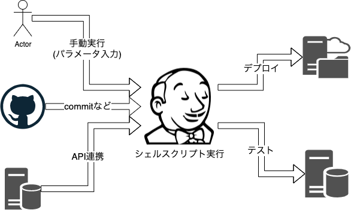
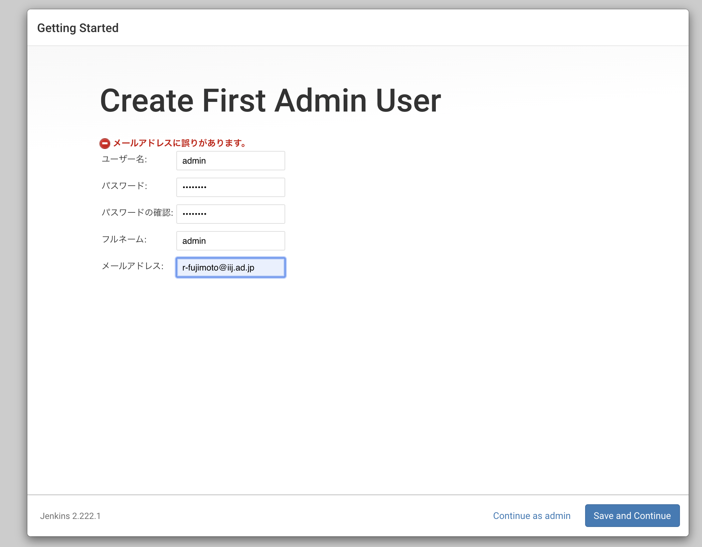
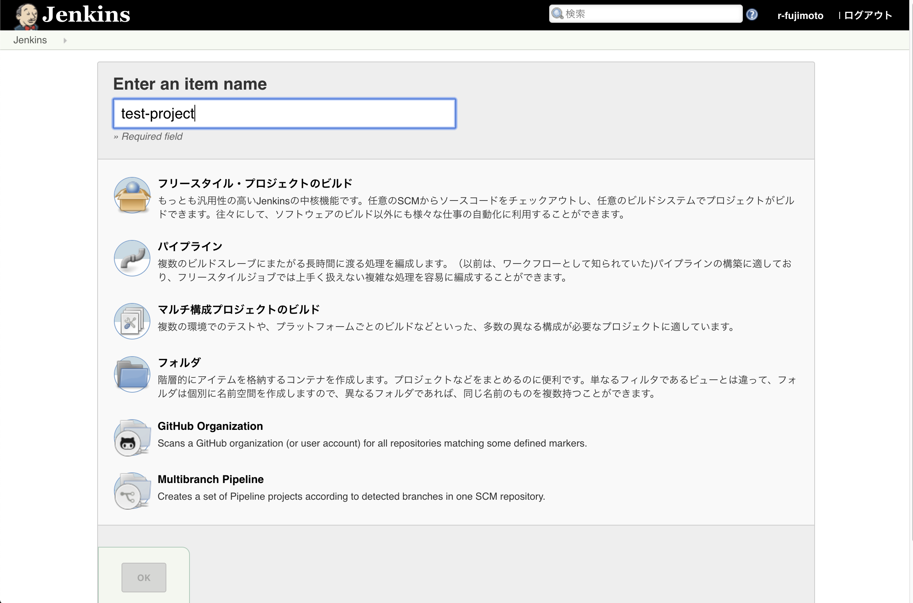
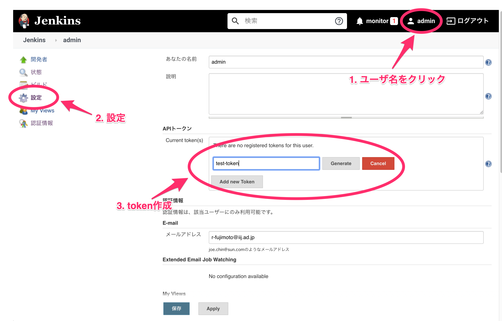
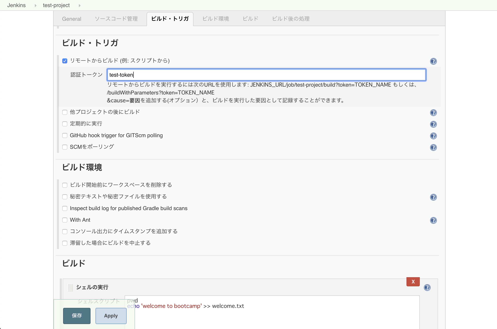
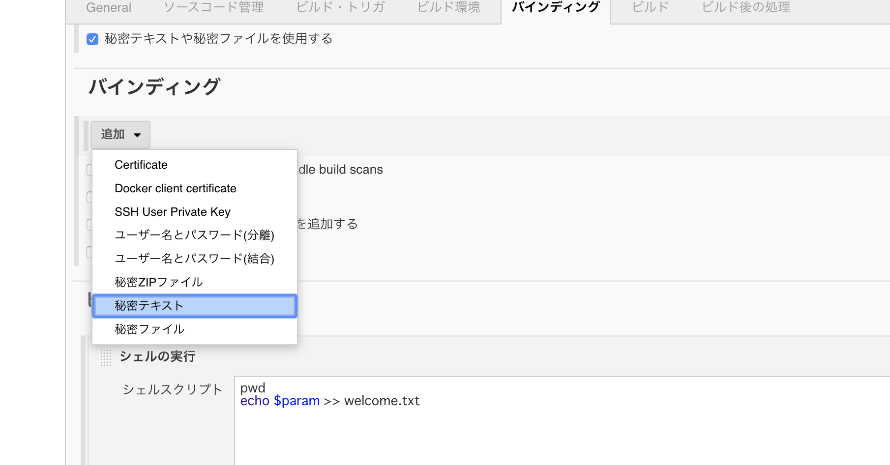
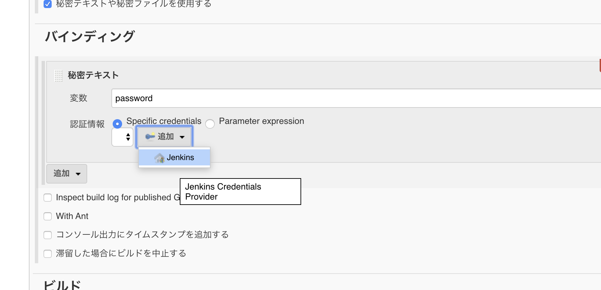
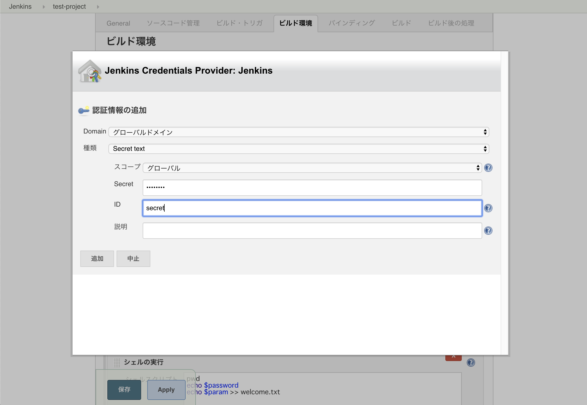
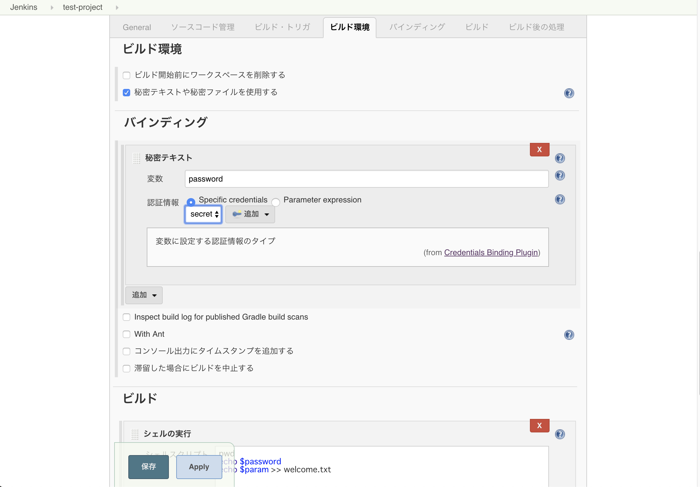
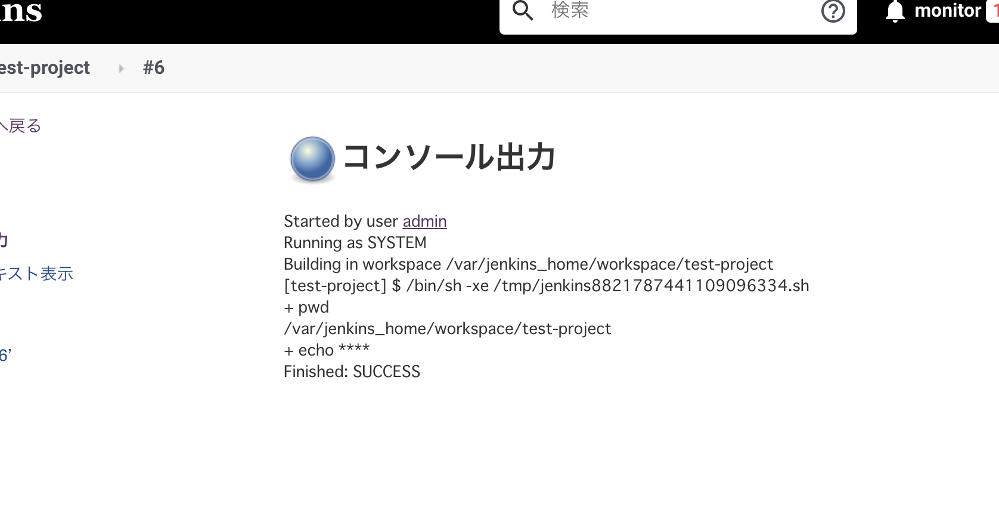

# Jenkins を触ってみよう

## 事前準備

この講義では Jenkins を試しに触るため、docker で手元に Jenkins を構築します。
イメージのダウンロードに少し時間がかかるので、pull だけ済ませておいてください。

```
docker pull jenkins/jenkins:lts
```

## Jenkins とは

2011 年に発表された CI（継続的インテグレーション）/ CD（継続的デリバリ）ツールの１つです。



「ジョブ」と呼ばれる単位で設定を作成し、それを手動で実行したりシステムから自動連携して実行することで、デプロイやテストを実行できるツールです。
ジョブの実行時は設定したシェルスクリプトを実行できるため、非常に柔軟なタスクの構築が可能です。

プラグインで機能を拡張できる他、master と slave 構成にして大規模にスケールさせることも可能です。

昨今の drone.io や GitHub Actions といったツールが、Docker コンテナを使ってタスクの実行環境をカプセル化しているのに対し、Jenkins では実行環境はすべてのタスクで共通です。
これはつまり、あるジョブで Ruby を実行したければ Jenkins が動作しているホストに Ruby をインストールする必要があります。そうするとタスクによって異なる Ruby のバージョンを使うのが非常に難しくなります。

そうした管理の煩雑さから、昨今では Docker コンテナを使った CI ツールを使うことが大半です。
しかし単にシェルスクリプトを書けば何でも実行してくれる Jenkins は、うまく管理してやれば非常にシンプルで強力なツールになるため、現在でも活躍の機会は多々あります。

このハンズオンでは扱いませんが、現在の Jenkins では「Pipeline」というジョブを定義することで、drone などと同じように JOB の実行内容をファイルで定義できます。また Docker プラグインを利用することで、Docker を使ったジョブの実行も可能です。

### 補足: CI（継続的インテグレーション）

CI とは、プログラムの開発中にテストやデプロイを頻繁に実施することで、問題を早期に発見することを目的とした開発手法です。
たとえば丸々一ヵ月開発してからはじめてデプロイ・テストをするよりも、変更の度に何回も軽めのテストを実施するほうが早期に問題を発見・修正できます。
（もちろん最終的な結合試験も必要不可欠です）

Jenkins のような CI ツールはそのような開発スタイルをサポートするためのツールで、GitHub の commit などをトリガにしてテストやデプロイを実施して結果を知らせてくれるツールの総称です。

最近の主要な CI ツールとしては

- Jenkins
- Circle CI
- Travis CI
- drone.io
- GitHub Actions

などが上げられます。

## Jenkins を立ち上げてみる

Jenkins を試しに触るため、docker を使って手元に構築してみましょう。
社内に供用で使える Jenkins サーバが立っていればそちらを使うこともできます。講師の指示にしたがってください。

docker の使える環境で以下のコマンドを実行して、Jenkins を実行してください。

```bash
mkdir jenkins
docker run -p 8080:8080 -p 50000:50000 --mount type=bind,source=%CD%¥jenkins,target=/var/jenkins_home,ro jenkins/jenkins:lts
```

途中で以下のように初期パスワードが表示されるため、コピー&ペーストしておきましょう。

```
*************************************************************
*************************************************************
*************************************************************

Jenkins initial setup is required. An admin user has been created and a password generated.
Please use the following password to proceed to installation:

050703f1fa114304839a65244184d222 <- 初期パスワードの例

This may also be found at: /var/jenkins_home/secrets/initialAdminPassword

*************************************************************
*************************************************************
*************************************************************
```

`Jenkins is fully up and running` と表示されたら成功です。 `localhost:8080` をブラウザで開いてみてください。以下のような画面が表示されると思います。


先ほどコピー&ペーストしたパスワードを入力して「Continue」を押しましょう。すると次の画面が表示されます。


「Install suggested plugins」を選んでください。すると plugin のインストールが自動的に始まります。plugin のインストールが終わると以下の画面が表示されるので、適当に入力しましょう。



最終的に「Jenkins へようこそ！」と表示されれば成功です。


## Jenkins を使ってみよう

早速試しに使ってみましょう。「新しいジョブを作成」をクリックするとジョブの作成画面に入ります。まずは「フリースタイル・プロジェクトのビルド」をクリックしてください。



作成するとジョブの設定画面が開きます。色々設定がありますが、まずは「ビルド」からスクリプトを登録してみましょう。「ビルド手順の追加」から「シェルの実行」を選ぶとスクリプトを登録できます。


たとえば以下のようなスクリプトを設定してみてください。

```bash
pwd
echo 'welcome to bootcamp' >> welcome.txt
```

「保存」をクリックするとジョブが作成されるので、「ビルド実行」を押して実行してみます。
「ビルド履歴」に`#1`が増えたでしょうか。`#1`をクリックして「コンソール出力」をクリックするとビルドの様子を確認できます。


## ワークスペース

上の例ではシェルスクリプトで`welcome.txt`というファイルを作成しました。このようにビルドの実行で生成されるファイルを「成果物」と呼んだりします。

成果物はどこに作られているでしょうか。以下のようにディレクトリを覗いてみると、成果物が生成されているのが分かります。

```bash
$ cat jenkins/workspace/test-project/welcome.txt
welcome to bootcamp
```

ディレクトリ名からも分かる通り、ジョブが実行されるディレクトリを「ワークスペース」と呼び、成果物も基本的にここに作成されます。ワークスペースはジョブ毎に別々に作られるため、他のジョブに影響されず実行することができます。

成果物はジョブの実行前に自動で削除するようにも設定できますが、そうでない場合は前回の成果物がそのまま残っているためスクリプトを作る際は注意が必要です。また成果物を残しすぎると Jenkins ホストのディスクを圧迫するため不要な成果物は削除するようにしましょう。

## ビルドトリガー

先ほどはジョブを手動で実行しましたが、他にも様々な方法でビルドを実行することができます。
Webhook などの HTTP リクエストからジョブを実行するトリガーを設定してみましょう。

まずは Jenkins の API token を取得します。



画像の通り 右上の admin -> 設定 -> API トークン から token を生成します。
このとき生成された token をコピペするのを忘れないでください。

画面上部のパンくずリストなどからジョブのトップ画面に移動し、「設定」をクリックして設定画面に移動しましょう。「ビルド・トリガ」からトリガーを設定することができます。「リモートからビルド」を選ぶと HTTP リクエストによるビルドを登録できます。



認証トークンを設定できるので適当な文字列設定して保存します。保存後、設定画面に書かれているように`localhost:8080/job/test-project/build`にリクエストしてみましょう。先ほど取得した API token を使用するため、ここで入力した JOB ごとの認証トークンは使用しません。

```bash
curl -X POST --user 'admin:<API token>' 'http://localhost:8080/job/test-project/build?token=test-token'
```

上記を実行するとジョブが実行されます。
このように Jenkins は外部のプログラムから簡単にジョブを実行することができます。

## パラメータ付きビルド

ビルドにはパラメータを設定することができます。「General」にある「ビルドをパラメータ化」からパラメータを設定してみてください。


設定したパラメータは環境変数として使えます。スクリプトを以下のようにしてみてください。

```bash
pwd
echo $param >> welcome.txt
```

パラメータ付きビルドをリモートから実行するには、先ほどの例に加えてパラメータの内容をリクエストに含めます。

```bash
curl -X POST -F 'param=bootcamp' -u 'admin:<API token>' http://localhost:8080/job/test-project/buildWithParameters
```

ビルドの履歴から結果を見ると、`echo boocamp`というコマンドが実行されているのが分かります。

## 秘密情報の利用

Jenkins ではパスワードなど秘密情報を取り扱う機能があります。パスワードをスクリプトに直接書いてしまうと誰でも見えてしまうので、外には表示されない状態で埋め込むことができます。

ジョブ設定画面「ビルド環境」にある「秘密テキストや秘密ファイルを利用する」を使います。
秘密情報である `password` を埋め込んでみましょう。まずは「追加」から「秘密テキスト」を選択しましょう。



「変数」には先ほどのパラメータ化と同様に、この秘密情報を埋め込むときの変数名を指定します（今回は `password`）。
「認証情報」には、Jenkins に保存されている秘密情報の中から紐付ける対象を選択できます。今はまだ何も登録されていないと思うので、「追加」から秘密情報を追加してみましょう。追加先には「Jenkins」を選択してください。



すると秘密情報の登録画面に移るので、画像の通り入力して「追加」を選択してください。「種類」は「Secret text」、「ID」には`secret`、「Secret」には適当なパスワード文字列を設定しておきます。



secret を追加したら先ほどの画面で`secret`が選べるようになっているので、選択して保存しましょう。



スクリプトを以下のようにすると、先ほど設定したパスワードが使えます。

```bash
pwd
echo $password >> welcome.txt
```

`welcome.txt`を見てみると、先ほど設定したパスワードが入力されているのが確認できます。

```bash
$ cat jenkins/workspace/test-project/welcome.txt
welcome to bootcamp
bootcamp
hogehoge <- パスワード
```

ちなみに Jenkins の実行結果画面では、秘密情報はマスクされて見えないようになっています。



## 最後に

Jenkins は非常に様々なことができますが、その分使いこなすのが難しいです。さらに環境によってバージョンの違いや入っているプラグインの違いで微妙に使い勝手が違ったり、使い方が分かりにくかったり苦労することもあります。

ただしきちんと運用された Jenkins サーバーを適切に使うと、様々なシステムと連携して自由度の高いビルドを実施できるため開発などの業務を効率化することができます。

スクリプトの変更履歴管理がしにくいため、スクリプトを git に置いて clone して実行するなども有効です。

<credit-footer/>
