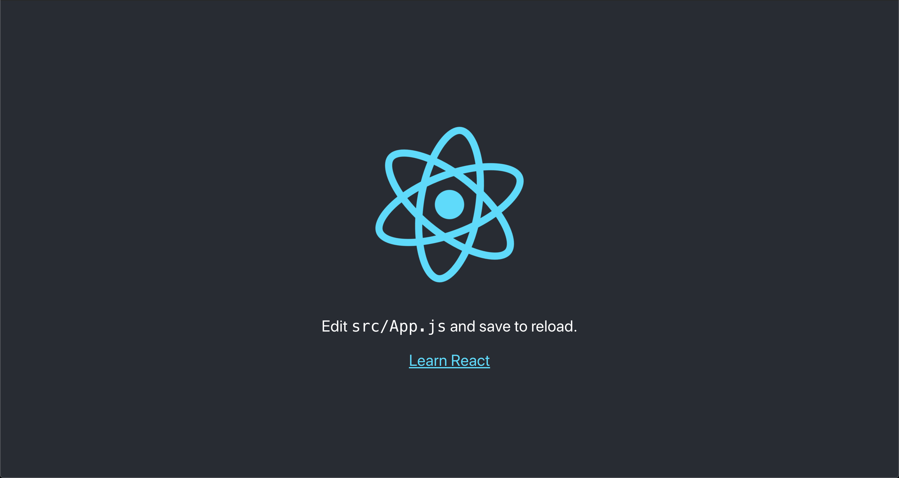

<header-table/>

# React でシングルページアプリケーション(=SPA)を書こう

IIJ Bootcamp React に関する資料です。あらかじめ Bootcamp のリポジトリをローカルへ clone し、下準備まで終わらせておいてください。

```bash
git clone https://github.com/iij/bootcamp.git
cd src/frontend/react
docker-compose up -d
```

## 始めに

この Bootcamp では React を利用して 簡単なフロントエンドアプリケーションの作成を実施します。

具体的には、下記を達成できるようになることを期待しています。

- フロントエンドアプリケーションという概念を知る
- React のコンポーネントベースで実装
- API サーバからデータを取得、保存する流れ

一方、下記の内容についてはこの Bootcamp で解説しません。

- 仮想 DOM、React の動作原理
- Jest などの単体テストツール
- Redux

## 下準備

下準備として、Docker の動作確認とテキストエディタの設定などを行っておいてください。このハンズオンでは Docker コンテナ内部でアプリケーションの開発を行うので、VSCode の RemoteDevelopment 拡張機能を利用することをおすすめします。

詳細 > [下準備・環境構築編](./prepare.md)

## React とは

React は、元々は Facebook 社が開発している Web ユーザインターフェースのためのフレームワークです。

しかし今では WebUI のみならず Native アプリへのコンパイルなど幅広く活躍が期待されているフレームワークです。

## Create React App

React を始めるための方法としては、いくつかの方法があります。

React の基礎を体験したいだけなら、オンラインサービスを使って体験するのが一番簡単です。

- [CodePen](https://reactjs.org/redirect-to-codepen/hello-world)
- [CodeSandbox](https://codesandbox.io/s/new)
- [Glitch](https://glitch.com/edit/#!/remix/starter-react-template)

また、既存の HTML ページの中に React で書いたものを埋め込むだけなら、下記のチュートリアルが参考になります。

- [Add React to a WebSite](https://reactjs.org/docs/add-react-to-a-website.html)

このハンズオンでは SPA 構築するため、下記のリンクの内容に沿って React のプロジェクトのひな型を作成します。

- [Create React App](https://facebook.github.io/create-react-app/docs/getting-started)

```bash
cd /app
npm start
```

`npx create-react-app`コマンドで作成されたひな型は`npm start`コマンドで React が開発サーバ上で起動するようになっています。デフォルトの設定では 3000 ポートに立ち上がります。

開発サーバが起動すると、localhost:3000 にブラウザでアクセスすると下記のようなページが表示されることを確認してください。



チェックポイント

- [] React のプロジェクトのひな型を作成した
- [] `npm start`で React の開発サーバを起動した

## React を書いてみる

開発サーバは、ソースコードの変更を検知して、その変更を即座にブラウザに伝えてくれます。

さっそくひとつやってみましょう。

src/App.js を開き下記の通りに編集してみましょう。

```javascript
import React from "react";
import "./App.css";

function App() {
  return (
    <div className="App">
      <header className="App-header">
        <div>Hello World!!</div>
      </header>
    </div>
  );
}

export default App;
```

するとブラウザが自動的にリロードされ、下記のような画面に変わります。


:::tips

Javascript を書いたことのある人にとって、にわかに JavaScript のコードだとは思えない HTML と ES2015 のコードが混ぜこぜになっているようなコードが出てきました。

この HTML 風の表現になっている部分は、[JSX](http://facebook.github.io/jsx/)という JavaScript の拡張構文で、実際には JavaScript にトランスパイルされてから実行されます。

JSX についての詳細には踏み込みませんが、3 点だけ注意しておきます。

1. JSX は HTML 風の記法で HTML 出力のためのコードを記述できるものであって、HTML そのものではありません。
2. HTML では CSS のクラス名を適用するのに class 属性を記述しますが、class は ECMAScript の予約語なので、これを避けて className という語を用います。(上の例にあるとおりです。)
3. (上記の例では出てきませんが)HTML では label タグに for 属性を使いますが、for は JavaScript の予約語なので、これを避けて htmlFor という語を用います。

ここでは div タグによって作られた DOM ツリーを表現するオブジェクトを生成して return しています。

(JSX は、あくまでも記法なので、JSX を使わずに同じ意味のコードを書くことは可能です。が、React で開発する人のほとんどは JSX を利用しますので、本ハンズオンでは解説しません。)
:::

React は UI を構築際に各 UI の部品をコンポーネントという単位に分割して再利用性を高めて実装を行います。

その Component を作ってみましょう。Component を記述する方法はいくつかありますが、今回は一般的なクラスベースのコンポーネントを作成してみます。

以下のソースコードを src/Note.js に作成してください。

```javascript
import React from "react";

export default class Note extends React.Component {
  render() {
    return <p>Component! Component!! Component!!!</p>;
  }
}
```

その上で、src/App.js で Note を使うように修正します。

```javascript
import React from "react";
import "./App.css";
import Note from "./Note";

function App() {
  return (
    <div className="App">
      <header className="App-header">
        <Note />
        <Note />
      </header>
    </div>
  );
}

export default App;
```

さあ、ブラウザに表示されている内容が変化したと思います。


このように。React では Component という UI 部品を組み合わせることでデザイン、UI を作成していきます。

チェックポイント

- [] React の基本の書き方を学んだ
- [] Component の書き方を学んだ
- [] Component の使い方を学んだ

### やってみよう

src/App.js を見てみると、src/Note.js のコンポーネントとは構成が異なります。src/App.js は関数型コンポーネントといい、複雑な機能を持たないコンポーネントを作成する際によく用いられます。

ここで、コンポーネントに慣れるために src/App.js をクラスベースのコンポーネントに書き直してみましょう。

```javascript
import React from "react";
import "./App.css";
import Note from "./Note.js";

class App extends React.Component {
  render() {
    return (
      <div className="App">
        <header className="App-header">
          <Note />
          <Note />
          <Note />
        </header>
      </div>
    );
  }
}

export default App;
```

## Component 組み込みの機能

### Props

Note コンポーネントを作成しましたが、今のままでは"Component! Component!! Component!!!"と叫ぶだけのコンポーネントで再利用性が悪いです。

他も文字でも叫ぶことができるように、叫ぶ文字を外から渡してあげるようにしましょう。

src/Note.js を下記のように修正してみましょう。

```javascript
import React from "react";

export default class Note extends React.Component {
  // (3, "Component") => "Component! Component!! Component!!!"
  constructWord = (number, word) => {
    let words = "";
    for (let counter = 0; counter < number; counter++) {
      words += word + "!".repeat(counter + 1) + " ";
    }
    return words.trimEnd();
  };

  render() {
    return <p>{this.constructWord(this.props.number, this.props.word)}</p>;
  }
}
```

そして、src/App.js

```javascript
import React from "react";
import "./App.css";
import Note from "./Note";

class App extends React.Component {
  render() {
    return (
      <div className="App">
        <header className="App-header">
          <Note word={"Component"} number={1} />
          <Note word={"Hoge"} number={2} />
          <Note word={"Huga"} number={3} />
        </header>
      </div>
    );
  }
}

export default App;
```

ここまで修正すると、下記の通りにブラウザの表示が変わります。


このように外部からパラメータを渡す場合、コンポーネントは`props`フィールドからそのパラメータを取得してくることができます。注意が必要なことは、`props`フィールドは Readonly なため、`props`フィールドの中身を書き換えたりすることはできません。

チェックポイント

- [] Component の Props について学んだ
- [] Component 間のパラメータの受け渡し方を学んだ

### State

`props`フィールドを通じてコンポーネント間のデータの受け渡しはできましたが、ユーザーからの入力や外部から取得した情報はどのように保存するべきでしょうか？

Component には State というデータの保存する機構が付属されています。試しに、ユーザーがボタンを押した数だけ叫ぶ回数を増やすように実装してみましょう。

src/Note.js を下記の通りに修正してください。

```javascript
import React from "react";

export default class Note extends React.Component {
  constructor(props) {
    super(props);
    this.state = {
      counter: 1,
    };
  }

  click = () => {
    // Stateのカウンタをインクリメント
    this.setState({
      counter: this.state.counter + 1,
    });
  };

  // (3, "Component") => "Component! Component!! Component!!!"
  constructWord = (number, word) => {
    let words = "";
    for (let counter = 0; counter < number; counter++) {
      words += word + "!".repeat(counter + 1) + " ";
    }
    return words.trimEnd();
  };

  // インラインスタイル
  mystyle = {
    display: "flex",
    "justify-content": "center",
    "align-items": "center",
  };

  render() {
    return (
      <div style={this.mystyle}>
        <button onClick={this.click} style={{ "min-width": "75px" }}>
          Click me!!
        </button>
        <p>{this.constructWord(this.state.counter, this.props.word)}</p>
      </div>
    );
  }
}
```

ここまで修正すると下記の通りになります。


State は Component の内部でのみ生きているデータベースのようなものです。State の特徴として`setState`メソッド経由で State に更新が走ると関連するコンポーネントや DOM が自動で更新されます。

実際に"Click me!!"のボタンをクリックしてみてください。

チェックポイント

- [] State を利用してローカルデータベースを作成することができる
- [] setState メソッドで State を更新すると DOM が自動でリロードされる

:::tips Redux

State を利用することで、単一のコンポーネントでデータを保存できることがわかりました。しかし認証やフォームデータなど複数のコンポーネントをまた貼ってグローバルに書き込みを行いたい場合もあります。

その場合は`Redux`というモジュールを使うと良いでしょう。Redux はアプリケーションの状態を管理するためのモジュールで React と親和性が非常に高いためよく利用されます。

ただし Redux は扱いに癖があり、特に Typescript なしでは導入が難しいためこのハンズオンでは紹介に留めておきます。

詳しくはこちら > [React Redux](https://react-redux.js.org/introduction/quick-start)

:::

## API からデータを取得してみる

Component の機能として、主に利用する部分について解説が終わりました。ここまでの知識で簡単なアプリケーションの構築はできるようになったはずです。

しかし、実際に SPA としてアプリケーションを構築する際は外部の API を経由してデータを取得してくることが多いです。そこで今回は`axios`という HTTPClient モジュールを利用して、データの取得〜State に保存〜画面に描画 の流れを体験してもらいます。

### axios を使ってみよう

このハンズオンで起動した docker-compose は起動時にモックサーバーも一緒に立ち上がるように設定されています。
このモックサーバは 5000 番ポートをリッスンしているので、起動を確認するために一度アクセスしてみましょう。

モックサーバー > [localhost:5000](http://localhost:5000)


この内容を React 経由で取得し、ブラウザに表示してみましょう。
src/App.js に修正を加えます。

```javascript
import React from "react";
import "./App.css";
import axios from "axios";

class App extends React.Component {
  constructor(props) {
    super(props);
    this.state = {
      info: "",
    };
  }

  click = () => {
    axios.get("http://localhost:5000/menu").then((response) => {
      this.setState({
        info: response.data,
      });
    });
  };

  render() {
    return (
      <div className="App">
        <header className="App-header">
          <button onClick={this.click}>Call API!!</button>
          <div>{JSON.stringify(this.state.info)}</div>
        </header>
      </div>
    );
  }
}

export default App;
```

App クラスに新たな State`info`を追加し、また`axios`で HTTP のリクエストを送るメソッド`click`を追加しました。
"Call API"ボタンを押下すると文字列が表示されたと思います。

これは[localhost:5000](http://localhost:5000)で配信しているコンテンツを`axios`モジュールが拾ってきて State に保存したため、その内容が画面に表示されることになりました。

このように`axios`モジュールを利用することで外部から情報を取得してユーザーインターフェースに組み込むことができるようになります。

チェックポイント

- `axios`モジュールを使ってみた
- 外部 API コールを試してみた

### コンポーネントのライフサイクルを触ってみよう

さて、多くの Web サイトで「画面の初期表示のタイミングで外部からデータを取得して画面に表示する」というケースを見かけます。これを実装してみましょう！

src/App.js を下記のように修正します。

```javascript
import React from "react";
import "./App.css";
import axios from "axios";

class App extends React.Component {
  constructor(props) {
    super(props);
    this.state = {
      info: "Loading...",
    };
  }

  componentDidMount = () => {
    axios.get("http://localhost:5000/menu").then((response) => {
      this.setState({
        info: response.data,
      });
    });
  };

  render() {
    return (
      <div className="App">
        <header className="App-header">
          <div>{JSON.stringify(this.state.info)}</div>
        </header>
      </div>
    );
  }
}

export default App;
```

画面を何度もリロードすると、一瞬"Loading..."という文字列が見えた瞬間、Json が画面に表示されたはずです。


この`componentDidMount`はブラウザ上にコンポーネントが描画された直後に走る React の提供しているメソッドです。

React のコンポーネントは`componentDidMount`のようにいくつかのライフサイクル用のメソッドが用意されています。これらのライフサイクルメソッドを利用することでコンポーネントの初期化や後処理を定義することができるようになります。

1. コンポーネントが生成

- コンストラクタ

2. コンポーネントが DOM にロード(マウント)

- componentDidMount

3. コンポーネントが DOM か削除される

- componentWillUnmount

それぞれのタイミングで実施したい処理があれば、それぞれのメソッドの中に実装してあげると良いでしょう。

詳しくはこちら > [state とライフサイクル | React Docs](https://ja.reactjs.org/docs/state-and-lifecycle.html)

## そろそろいい感じにしてみましょう

これまでの中で下記のことを学びました。

- コンポーネントによる UI の分割
- コンポーネント親子間のデータの保存、連携方法
- `axios`モジュールによる外部 API のコール
- コンポーネントのライフサイクルフック

基本的な知識が身についていることを踏まえ、これらを複合して UI を作成してみましょう！

<credit-footer/>
