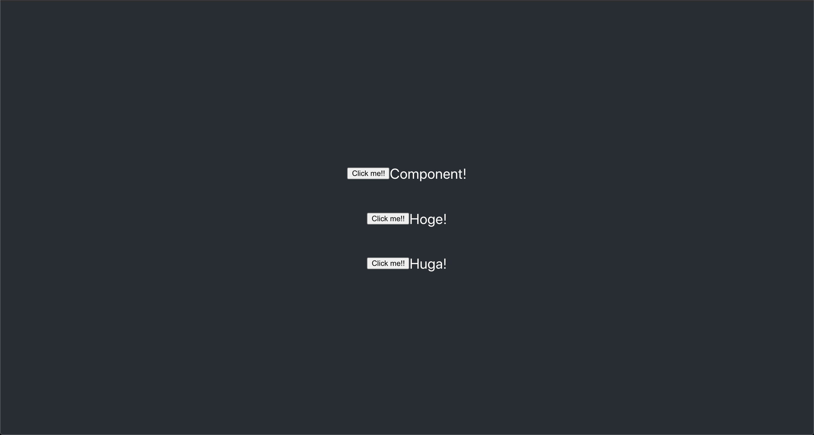
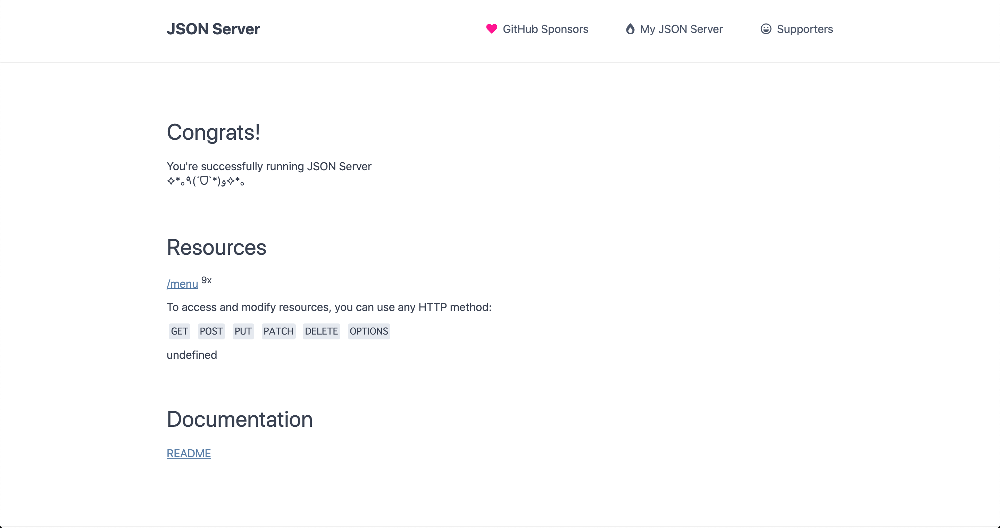
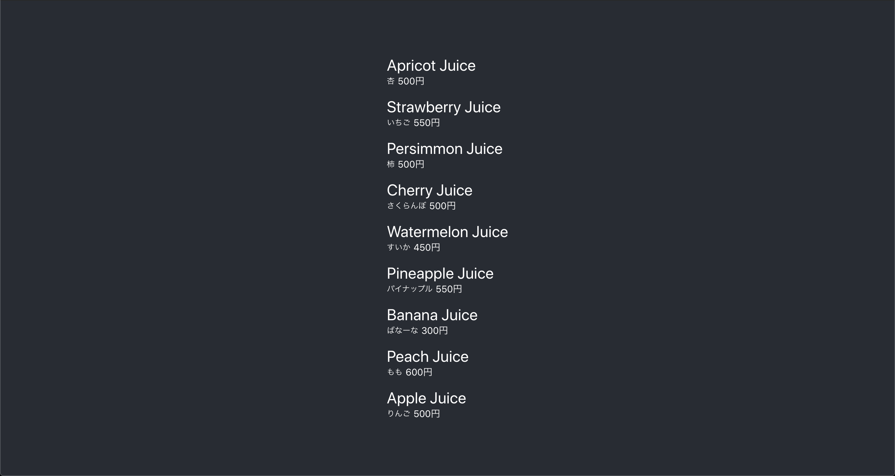

<header-table/>

IIJ Bootcamp React に関する資料です。あらかじめ Bootcamp のリポジトリをローカルへ clone し、下記のコマンドを叩いて準備まで終わらせておいてください。

```bash
git clone https://github.com/iij/bootcamp.git
cd src/frontend/react
docker-compose up -d
```

# React でシングルページアプリケーション(=SPA)を書こう

## 始めに

この Bootcamp では React の動作原理を学びながら簡単なシングルページアプリケーションの作成を行います。
フロントエンド開発とはどのようなものか、経験して今後のエンジニア人生の糧になれば良いと思います。

この Bootcamp を通して、具体的に下記を達成できるようになることを期待しています。

- フロントエンド開発を経験する
- コンポーネントベース開発を経験する
- React 開発の流れを理解する
- API サーバとフロントエンドアプリケーションの間で通信を行う経験する

一方、下記の内容についてはこの Bootcamp で解説しません。

- 仮想 DOM、React の動作原理
- Jest などのユニットテストツール
- Redux などの状態管理ツール

## 推奨環境

Bootcamp を実施するうえで、下記の環境を推奨とします。

### Docker / docker-compose

IIJ Bootcamp 全体を通して必要となるコンテナを動かすためのミドルウェア。

### Visual Studio Code

React を含め、いまやフロントエンド開発を進めるうえで IDE は必須です。筆者は Microsoft 社の Visual Studio Code を推奨しています。

#### 拡張機能 Remote Development

Visual Studio Code と Docker の組み合わせで開発をする場合、Remote Development の拡張機能をインストールすることをお勧めします。この拡張機能を利用することで、コンテナ内部で Visual Studio Code を開くことができます。

## React とは

React は、もともと Facebook 社が開発している Web ユーザーインタフェースのためのフレームワークです。しかし今では Web のインタフェース のみならず Native アプリケーションへのコンパイルなど幅広く活躍が期待されているフレームワークです。

React を用いることで、コードが煩雑になりがちでメンテナンスが難しくなるフロントエンドの開発をスマートにできました。

:::tips Create React App

React を始めるための方法としては、いくつかの方法があります。

- React の基礎を体験したい = オンラインサービスを使う
  - [CodePen](https://reactjs.org/redirect-to-codepen/hello-world)
  - [CodeSandbox](https://codesandbox.io/s/new)
  - [Glitch](https://glitch.com/edit/#!/remix/starter-react-template)
- 既存の HTML ページの中に React 埋め込みたい = 下記のチュートリアル
  - [Add React to a WebSite](https://reactjs.org/docs/add-react-to-a-website.html)
- フルに React を使ってアプリケーションを作りたい = Create ReactApp
  - [Create React App](https://facebook.github.io/create-react-app/docs/getting-started)

このハンズオンでは、最初から React を使うことを想定して CreateReactApp を使ったプロジェクトひな型を作成しています。

:::

## Hello World

### 初回起動

`docker-compose up`で起動した`bootcamp-react`コンテナ内部にアクセスし、下記のコマンドをたたきましょう。

```bash
cd /app
npm start
```

下記の文言が出力されたら React の開発サーバが 3000 番ポートで起動しています。

<pre>
Compiled successfully!

You can now view app in the browser.

  Local:            http://localhost:3000
  On Your Network:  http://XXX.XXX.XXX.XXX:3000

Note that the development build is not optimized.
To create a production build, use yarn build.
</pre>

localhost:3000 にブラウザでアクセスすると下記のようなページが表示されることを確認してください。


チェックポイント

- `npm start`で React の開発サーバを起動した
- React の初期ページを確認した

### Hello World

React の開発サーバは、ソースコードの変更を検知してその変更をブラウザに伝えてくれます。
さっそくひとつやってみましょう。

src/App.js を開き下記の通りに編集してみましょう。

```javascript
import React from "react";
import "./App.css";

function App() {
  return (
    <div className="App">
      <header className="App-header">
        <div>Hello World!!</div>
      </header>
    </div>
  );
}

export default App;
```

するとブラウザが自動的にリロードされ、下記のような画面に変わります。

※ 環境にとっては自動リロードしてくれない場合もあります。そのときはリロード(F5)をしてみてください。


チェックポイント

- React で Hello World を実施した

## コンポーネントを作成してみる

React は UI の部品を Component という単位に分割することで、ロジックやスタイルなどの再利用性を高めて実装を行います。

:::tips なぜ Component を使うのか

React ではなく Vue ですが、こちらの記事が非常にわかりやすい例です。Vue と React ともにコンポーネントベースのフレームワークですので、根幹は一緒です。

気になる人は読んでみてください。

[ワイ「何でそんな小っさいコンポーネント作ってるん？ｗ」 | Qiita](https://qiita.com/Yametaro/items/e8cb39b1a20b762bfafa)

:::

### 小さなコンポーネントを作成してみましょう

小さな Component を作ってみましょう。Component を記述する方法はいくつかありますが、まずクラスベースのコンポーネントを作成してみます。

以下のソースコードを src/Note.js として作成してください。

```javascript
import React from "react";

export default class Note extends React.Component {
  render() {
    return <p>Component! Component!! Component!!!</p>;
  }
}
```

さらに src/App.js が Note.js を使うように修正します。

```javascript
import React from "react";
import "./App.css";
import Note from "./Note";

function App() {
  return (
    <div className="App">
      <header className="App-header">
        <Note />
        <Note />
      </header>
    </div>
  );
}

export default App;
```

さあ、[localhost:3000](localhost:3000)にアクセスするとブラウザに表示されている内容が変化したと思います。


このように React では Component という UI 部品を組み合わせることでデザイン、UI を作成していきます。

チェックポイント

- クラスベースコンポーネントの書き方を学んだ
- Component の使い方を学んだ

### クラスベースコンポーネント

クラスベースコンポーネントは React の基本的な Component の記述方法です。

定義の方法は JavaScript のクラスに対して`React.Component`を継承させるだけです。
さらに`React.Component`を継承したクラスが`render`メソッドをオーバーライドすることにより、メソッド内で返却した DOM をブラウザがマウントして描画させることができます。

コンポーネントを使う側は export されたコンポーネントを HTML のタグのようにして宣言することでコンポーネントを利用できます。

### App.js をクラスベースコンポーネントに置き換えてみよう

src/App.js を見てみると、src/Note.js のコンポーネントとは構成が異なります。src/App.js は関数型コンポーネントと呼び、複雑な状態を持たないコンポーネントを作成する際によく用いられます。

試しに src/App.js をクラスベースのコンポーネントへ書き直してみましょう。

```javascript
import React from "react";
import "./App.css";
import Note from "./Note.js";

class App extends React.Component {
  render() {
    return (
      <div className="App">
        <header className="App-header">
          <Note />
          <Note />
          <Note />
        </header>
      </div>
    );
  }
}

export default App;
```

## Component 組込みの機能

### 小要素へのデータの共有 : Props

Note コンポーネントを作成しましたが、今のままでは"Component! Component!! Component!!!"と叫ぶだけのコンポーネントで再利用性が悪いです。

他も文字を叫ぶことができるように、叫ぶ文字を外から渡してあげるることができるようにしましょう。

src/Note.js を下記のように修正してみましょう。

```javascript
import React from "react";

export default class Note extends React.Component {
  // (3, "Component") => "Component! Component!! Component!!!"
  constructWord = (number, word) => {
    let words = "";
    for (let counter = 0; counter < number; counter++) {
      words += word + "!".repeat(counter + 1) + " ";
    }
    return words.trimEnd();
  };

  render() {
    return <p>{this.constructWord(this.props.number, this.props.word)}</p>;
  }
}
```

そして、src/App.js

```javascript
import React from "react";
import "./App.css";
import Note from "./Note";

class App extends React.Component {
  render() {
    return (
      <div className="App">
        <header className="App-header">
          // ComponentのPropsにデータを渡すには、DOMにパラメータを直接指定する
          <Note word={"Component"} number={1} />
          <Note word={"Hoge"} number={2} />
          <Note word={"Huga"} number={3} />
        </header>
      </div>
    );
  }
}

export default App;
```

ここまで修正すると、下記の通りにブラウザの表示が変わります。


親コンポーネントからデータを注入できるように`props`を適切に定義することで、Component の再利用性をあげることができます。
注意が必要なこととして`props`は Readonly なため、`props`の中身を書き換えたりすることはできません。

チェックポイント

- Component の `Props` について学んだ
- Component 間のパラメータの受け渡し方を学んだ

### State

`props`フィールドを通じてコンポーネント間のデータの受け渡しはできましたが、ユーザーからの入力や外部から取得した情報はどのように保存するべきでしょうか？
Component には State というデータの保存する機構が付属されています。試しに、ユーザーがボタンを押した数だけ叫ぶ回数を増やすように実装してみましょう。

src/Note.js を下記の通りに修正してください。

```javascript
import React from "react";

export default class Note extends React.Component {
  constructor(props) {
    super(props);
    // これがState
    // JavaScriptのオブジェクトとして登録する
    this.state = {
      counter: 1,
    };
  }

  click = () => {
    // ClickされたらStateのカウンタをインクリメント
    this.setState({
      counter: this.state.counter + 1,
    });
  };

  // (3, "Component") => "Component! Component!! Component!!!"
  constructWord = (number, word) => {
    let words = "";
    for (let counter = 0; counter < number; counter++) {
      words += word + "!".repeat(counter + 1) + " ";
    }
    return words.trimEnd();
  };

  // インラインスタイル
  mystyle = {
    display: "flex",
    "justify-content": "center",
    "align-items": "center",
  };

  render() {
    return (
      <div style={this.mystyle}>
        // ボタンをクリックされたらclick()メソッドが発火し、Stateが更新される
        <button onClick={this.click} style={{ "min-width": "75px" }}>
          Click me!!
        </button>
        // Stateのカウンタの数だけ叫ぶ
        <p>{this.constructWord(this.state.counter, this.props.word)}</p>
      </div>
    );
  }
}
```

ここまで修正すると下記の通りになります。



State は Component の内部でのみ生きているデータベースのようなものです。State を`setState`メソッド経由で更新を行うと、関連するコンポーネントや DOM が自動で更新されます。

実際に"Click me!!"のボタンをクリックしてみてください。

チェックポイント

- State を利用してローカルデータベースを作成できる
- setState メソッドで State を更新すると DOM が自動でリロードされる

:::tips Redux

State を利用することで、単一のコンポーネントでデータを保存できることがわかりました。しかし認証やフォームデータなど複数のコンポーネントを跨ってグローバルに書き込みを行いたい場合もあります。また State をもっと複雑に利用したいケースもでてきます。

その場合は Redux というモジュールを使うと良いでしょう。Redux はアプリケーションの状態を管理するためのモジュールで React と親和性が非常に高いためよく利用されます。

ただし Redux は扱いに癖があり、特に TypeScript なしでは導入が難しいためこのハンズオンでは紹介にとどめておきます。

詳しくはこちら > [React Redux](https://react-redux.js.org/introduction/quick-start)

:::

## API サーバからデータを取得してみる

親子間でのデータのデータのやりとりができるようになりましたが、このままではアプリケーションに組み込まれた情報でのみ表示ができるだけです。ほかのユーザーの情報やリアルタイムな情報等、アプリケーション以外のデータリソースからデータを取得する場合にはどのようにするのがよいでしょうか？

今回は外部にある HTTP のインタフェースを備えた API サーバをデータリソースとして、そこからデータを取得してアプリケーションに組み込んでみましょう。
データリソースにアクセスするためのクライアントモジュールとして、`axios`というモジュールを利用します。

### axios を使ってみよう

このハンズオンで起動した docker-compose は起動時にモックサーバも一緒に立ち上がるように設定されています。
このモックサーバは 5000 番ポートをリッスンしているので、起動を確認するために一度アクセスしてみましょう。

モックサーバ > [localhost:5000](http://localhost:5000)



このモックサーバが配信しているコンテンツをフェッチし、ブラウザに表示してみましょう。
src/App.js に修正を加えます。

```javascript
import React from "react";
import "./App.css";
import axios from "axios";

class App extends React.Component {
  constructor(props) {
    super(props);
    this.state = {
      info: "",
    };
  }

  click = () => {
    axios.get("http://localhost:5000/menu").then((response) => {
      this.setState({
        info: response.data,
      });
    });
  };

  render() {
    return (
      <div className="App">
        <header className="App-header">
          <button onClick={this.click}>Call API!!</button>
          <div>{JSON.stringify(this.state.info)}</div>
        </header>
      </div>
    );
  }
}

export default App;
```

App クラスに新たな State`info`を追加し、また`axios`で HTTP のリクエストを送るメソッド`click`を追加しました。
"Call API"ボタンを押下すると文字列が表示されたと思います。

これは[localhost:5000](http://localhost:5000)で配信しているコンテンツを`axios`モジュールが拾ってきて State に保存したため、その内容が表示されることになりました。

`axios`を利用することで、RESTFul API などの HTTP インタフェースで公開しているサーバと通信ができます。

チェックポイント

- `axios`モジュールを使ってみた
- 外部 API コールを試してみた

## コンポーネントのライフサイクルを触ってみよう

少しコンポーネントの複雑な機能について触れてみましょう。Component を作成することに注力しましたが、ここでは Component の作成の方法に注視してみましょう。

多くの Web サイトで「画面の初期表示のタイミングで外部からデータを取得して画面に表示する」というケースを見かけます。これを React の言葉に置き換えると「Component が表示されるタイミングで`axios`等のクライアントでデータをフェッチして Component に受け渡している」といったところでしょうか。
この機能は Component のライフサイクルを利用することで実現できます。実装してみましょう！

src/App.js を下記のように修正します。

```javascript
import React from "react";
import "./App.css";
import axios from "axios";

class App extends React.Component {
  constructor(props) {
    super(props);
    this.state = {
      info: "Loading...",
    };
  }

  componentDidMount = () => {
    axios.get("http://localhost:5000/menu").then((response) => {
      this.setState({
        info: response.data,
      });
    });
  };

  render() {
    return (
      <div className="App">
        <header className="App-header">
          <div>{JSON.stringify(this.state.info)}</div>
        </header>
      </div>
    );
  }
}

export default App;
```

画面を何度もリロードすると、一瞬"Loading..."という文字列が見えた瞬間、Json が画面に表示されたはずです。


初めて出てきた`componentDidMount`メソッドは`React.Component`で定義されているメソッドで、ブラウザ上にコンポーネントが描画された直後に走るメソッドです。

React のコンポーネントは`componentDidMount`のようにいくつかのライフサイクル用のメソッドが用意されています。
これらのライフサイクルメソッドを利用することでコンポーネントの初期化や後処理を定義できます。

1. コンポーネントが生成されるタイミング

- コンストラクタ

2. コンポーネントが DOM にロード(マウント)されるタイミング

- componentDidMount

3. コンポーネントが DOM から削除されるタイミング

- componentWillUnmount

それぞれのタイミングで実施したい処理があれば、それぞれのメソッドの中に実装してあげると良いでしょう。

詳しくはこちら > [state とライフサイクル | React Docs](https://ja.reactjs.org/docs/state-and-lifecycle.html)

## 自分の手でフロントエンドを作成してみましょう

先の節で`axios`モジュールを用いて外部サーバからデータを取得してきました。今までの知識を元に取得してきたデータを下記のような一覧表示する UI を作成してみましょう。



配信されているデータは下記の Food スキーマの配列です。データをパースして State に保存し、適切なコンポーネントに渡してあげましょう。

```typescript
interface Food {
  id: Number;
  name: String;
  description: String;
  price: Number;
}
```

:::details サンプルコード

`src/Food.js`

```javascript
import React from "react";

export default class Food extends React.Component {
  // インラインスタイルは御行儀が悪く、本来避けるべき
  // 代わりにCSS Modulesなどのスタイルローダーを使いましょう
  containerStyle = {
    margin: "15px",
  };

  rowStyle = {
    display: "flex",
    justifyContent: "flex-start",
    alignItems: "center",
    fontSize: "0.6em",
  };

  nameStyle = {
    margin: "0",
  };

  priceStyle = {
    margin: "0 5px",
  };

  render() {
    return (
      <div style={this.containerStyle}>
        <p style={this.nameStyle}>{this.props.name}</p>

        <div style={this.rowStyle}>
          <small>{this.props.description}</small>
          <p style={this.priceStyle}>{this.props.price}円</p>
        </div>
      </div>
    );
  }
}
```

`src/App.js`

```javascript
import React from "react";
import "./App.css";
import Food from "./Food";
import axios from "axios";

class App extends React.Component {
  constructor(props) {
    super(props);
    this.state = {
      data: undefined,
    };
  }

  componentDidMount = () => {
    axios.get("http://localhost:5000/menu").then((response) => {
      this.setState({
        data: response.data,
      });
    });
  };

  render() {
    let list;
    // Q: this.state.dataがundefinedになることはある？
    if (this.state.data) {
      list = this.state.data.map((row, key) => {
        return (
          <Food
            // このkeyはReactでコンポーネントのリストを作成する際に必要とされるもの
            // keyの値はリストの中でユニークであるべき
            // 詳細 : https://ja.reactjs.org/docs/lists-and-keys.html
            key={key}
            name={row.name}
            description={row.description}
            price={row.price}
          />
        );
      });
    } else {
      list = <p>Loading...</p>;
    }

    return (
      <div className="App">
        <header className="App-header">
          <div style={{ textAlign: "left" }}>{list}</div>
        </header>
      </div>
    );
  }
}

export default App;
```

:::

## 最後に

<s>いかがでしたか？</s> 以上で React のハンズオンは終了です。

昨今のフロントエンド界隈は比較的落ち着いてきた(=デファクトが固まりつつある)印象がありますが、それでも流行り廃りの早い世界です。この文書も、いつ時代遅れになるかもわかりません。

ですが、フロントエンドはアプリケーションの花形です。ぜひフロントエンドの知見を日々広げ、花形の開発者として活躍してもらえればうれしいです。

## 読み物

ここから先は React に関する情報をまとめた読み物です。興味のある人はさっと目を通してみてください。

### SPA はどこへ？

Bootcamp 冒頭で

> React でシングルページアプリケーション(=SPA)を書こう

と書いておきながら、SPA という言葉が一切出てきませんでした。実は、すでにこの Bootcamp で作成したコードが SPA になっています。

[シングルページアプリケーション | Wikipedia](https://ja.wikipedia.org/wiki/シングルページアプリケーション)

- サーバから配信する HTML は単一
  - 画面遷移が滑らか＆爆速
- フロントエンドの DOM の操作を JavaScript で行う
  - 物理 DOM の操作と比べて軽量

といったことが特徴です。create-react-app で構成したプロジェクトはデフォルトで SPA となっています。SPA でないものとして SSR(=サーバサイドレンダリング)が挙げられます。

### JSX(JavaScript 経験者向け)

この Bootcamp では JavaScript のコードだとは思えない HTML と ES2015 のコードが混ぜこぜになっているようなコードが出てきました。

この HTML 風の表現になっている部分は、[JSX](http://facebook.github.io/jsx/)という JavaScript の拡張構文で、実際には JavaScript にトランスパイルされてから実行されます。

JSX についての詳細には踏み込みませんが、3 点だけ注意しておきます。

1. JSX は HTML 風の記法で HTML 出力のためのコードを記述できるものであって、HTML そのものではありません。
2. HTML では CSS のクラス名を適用するのに class 属性を記述しますが、class は ECMAScript の予約語ですので、これを避けて className という語を用います。(上の例にあるとおりです。)
3. HTML では label タグに for 属性を使いますが、for は JavaScript の予約語ですので、これを避けて htmlFor という語を用います。

JSX は、あくまでも記法ですが、JSX を使わずに同じ意味のコードを書くことは可能です。ですが React で開発する人のほとんどは JSX を利用しますので明確な理由がない場合は JSX を利用することをお勧めします。

### PWA(PWA を知っている人向け)

React のビルド成果物は PWA 対応しています。PWA の設定方法はとても簡単で、src/index.js の下記の部分を変更するだけです。

```javascript
// If you want your app to work offline and load faster, you can change
// unregister() to register() below. Note this comes with some pitfalls.
// Learn more about service workers: https://bit.ly/CRA-PWA
serviceWorker.unregister();
```

コメントで書いてあるとおり、`unregister()`を`register()`に変えてあげるだけで PWA 対応になります。

<credit-footer/>
