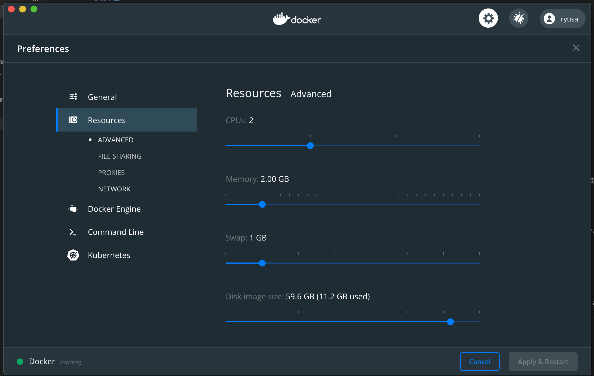
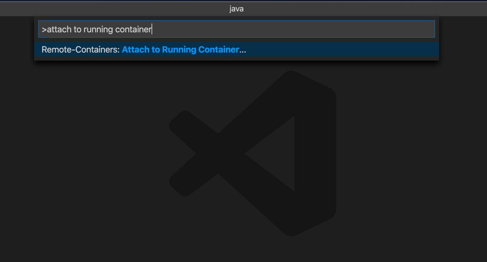

# 事前準備

IIJ Bootcamp の Java；Springboot を始める上でいくつか環境の整備をしておいてください。

## 環境整備

### 最低動作設定

#### docker

この Java ハンズオンの開発は Docker のコンテナの内部で実行します。そのため、事前に Docker のインストールと動作確認まで実施しておいてください。

> docker pull openjdk:11-slim

#### Visual Studio Code

このハンズオンでは Java の IDE として Microdsoft 社の提供する Visual Studio Code(以下 VSCode)を利用します。事前に VSCode のインストールと起動確認、および後述する RemoteDevelopment の拡張機能をインストールしておいてください。

#### Remote - Containers(VSCode 拡張機能)

Docker コンテナの内部のファイルシステムを VSCode 越しに利用することができるようになる拡張機能です。開発環境を Docker コンテナの中で閉じることができるようになります。

#### Java Extention Pack(VSCode 拡張)

Microsoft 社が提供する Java の開発を行う上で必要な機能がまとめられた拡張機能パックです。動作させるには JDK が必要になるため、`Remote - Containers`の拡張機能でコンテナ内部に入ったタイミングでインストールしておいてください。

### 推奨設定

#### 8GiB 以上のメモリー

Java の開発にはメモリーが取られます。ホストマシンのリソースに余裕のある方は、Docker の利用できるメモリー量を 4GiB 程度に一時的に増やしておくことをお勧めします。(Docker for Windows / Docker for Mac を利用の方は、設定画面 > リソースで Docker が利用できるメモリ量を調整できます。)



## 動作確認

::: details 　プロキシ環境下の追加設定
プロキシの中にいる人は`gradlew`ファイルの先頭部分にプロキシの設定を入れてあげてください。

```bash
#!/usr/bin/env sh

# 追記BEGIN
PROXY_HOST=proxy.example.com # set your proxy host
PROXY_PORT=8080 # set your proxy port
JAVA_OPTS="-Dhttp.proxyHost=$PROXY_HOST -Dhttp.proxyPort=$PROXY_PORT -Dhttps.proxyHost=$PROXY_HOST -Dhttps.proxyPort=$PROXY_PORT $JAVA_OPTS"
# 追記END

```

:::

### Docker の起動

環境が整ったら動作の確認をしましょう。下記のコマンドで Docker を起動しましょう。

> docker run -d -t --name bootcamp-java --mount type=bind,source="\$(pwd)/app",dst=/app -p 8080:8080 openjdk:11-slim

Docker が正常に起動したことを確認してください。

> docker ps | grep bootcamp-java | awk '{print \$7}'

"UP"と表示されれば Docker は動いています。

### VSCode の起動と Attach to Running Container

Docker の起動まで確認したら、VSCode を起動して Docker コンテナの内部へアクセスしてみましょう。

VSCode の左下から RemoteDevelopment を起動しコマンドパレットから`attach to running container`と入力しましょう。



:::tip コマンドパレットのショートカット

Mac

> command + shift + p

Windows

> ctrl + shift + p

:::

VSCode が開き、コンテナ内部へアクセスできたことを確認したら`/app`のディレクトリを開いてください。

### Java 開発環境構築

#### 拡張機能のインストール

VSCode に Java IDE としての設定を行います。まず拡張機能の`Java Extention Pack`をインストールしておいてください。

`Java Extention Pack`によって、プロジェクトの依存関係を解消しコードの補完が効くようになります。

拡張機能のインストールが終わったら、画面のリロードを行っておいてください。

### 初回起動

コマンドパレットに`toggle integrated terminal`と入力し、ターミナルを開きます。ターミナルが開いたら下記のコマンドを叩いてください。

> ./gradlew bootRun

10 分程度すると Springboot が起動したログが表示されます。

<pre>
> Task :bootRun

  .   ____          _            __ _ _
 /\\ / ___'_ __ _ _(_)_ __  __ _ \ \ \ \
( ( )\___ | '_ | '_| | '_ \/ _` | \ \ \ \
 \\/  ___)| |_)| | | | | || (_| |  ) ) ) )
  '  |____| .__|_| |_|_| |_\__, | / / / /
 =========|_|==============|___/=/_/_/_/
 :: Spring Boot ::        (v2.2.4.RELEASE)

2020-06-02 14:21:53.490  INFO 3961 --- [  restartedMain] com.example.demo.DemoApplication         : Starting DemoApplication on ebbd1863c7bf with PID 3961 (/app/build/classes/java/main started by root in /app)
2020-06-02 14:21:53.546  INFO 3961 --- [  restartedMain] com.example.demo.DemoApplication         : No active profile set, falling back to default profiles: default
2020-06-02 14:21:55.114  INFO 3961 --- [  restartedMain] .e.DevToolsPropertyDefaultsPostProcessor : Devtools property defaults active! Set 'spring.devtools.add-properties' to 'false' to disable
2020-06-02 14:21:55.115  INFO 3961 --- [  restartedMain] .e.DevToolsPropertyDefaultsPostProcessor : For additional web related logging consider setting the 'logging.level.web' property to 'DEBUG'
2020-06-02 14:22:06.932  INFO 3961 --- [  restartedMain] o.s.b.w.embedded.tomcat.TomcatWebServer  : Tomcat initialized with port(s): 8080 (http)
2020-06-02 14:22:06.993  INFO 3961 --- [  restartedMain] o.apache.catalina.core.StandardService   : Starting service [Tomcat]
2020-06-02 14:22:06.994  INFO 3961 --- [  restartedMain] org.apache.catalina.core.StandardEngine  : Starting Servlet engine: [Apache Tomcat/9.0.30]
2020-06-02 14:22:07.235  INFO 3961 --- [  restartedMain] o.a.c.c.C.[Tomcat].[localhost].[/]       : Initializing Spring embedded WebApplicationContext
2020-06-02 14:22:07.235  INFO 3961 --- [  restartedMain] o.s.web.context.ContextLoader            : Root WebApplicationContext: initialization completed in 12118 ms
2020-06-02 14:22:07.926  INFO 3961 --- [  restartedMain] o.s.s.concurrent.ThreadPoolTaskExecutor  : Initializing ExecutorService 'applicationTaskExecutor'
2020-06-02 14:22:08.640  INFO 3961 --- [  restartedMain] o.s.b.d.a.OptionalLiveReloadServer       : LiveReload server is running on port 35729
2020-06-02 14:22:08.806  INFO 3961 --- [  restartedMain] o.s.b.w.embedded.tomcat.TomcatWebServer  : Tomcat started on port(s): 8080 (http) with context path ''
2020-06-02 14:22:08.825  INFO 3961 --- [  restartedMain] com.example.demo.DemoApplication         : Started DemoApplication in 21.232 seconds (JVM running for 28.351)
</pre>

ホストマシンから[localhost:8080](http://localhost:8080)にアクセスしてみましょう。


上記のようなエラーページが表示されていれば、環境のセットアップ完了です。

::: warning
bootRun を実行することで、環境によっては"想像を絶する重さ"になると思います。理由としては`Java Extention Pack`が Java の依存関係を解消しようと裏で動いていることが原因です。

IDLE が表示されているまま、動くまで少々お待ちください。。。初回だけなので。。。
:::
