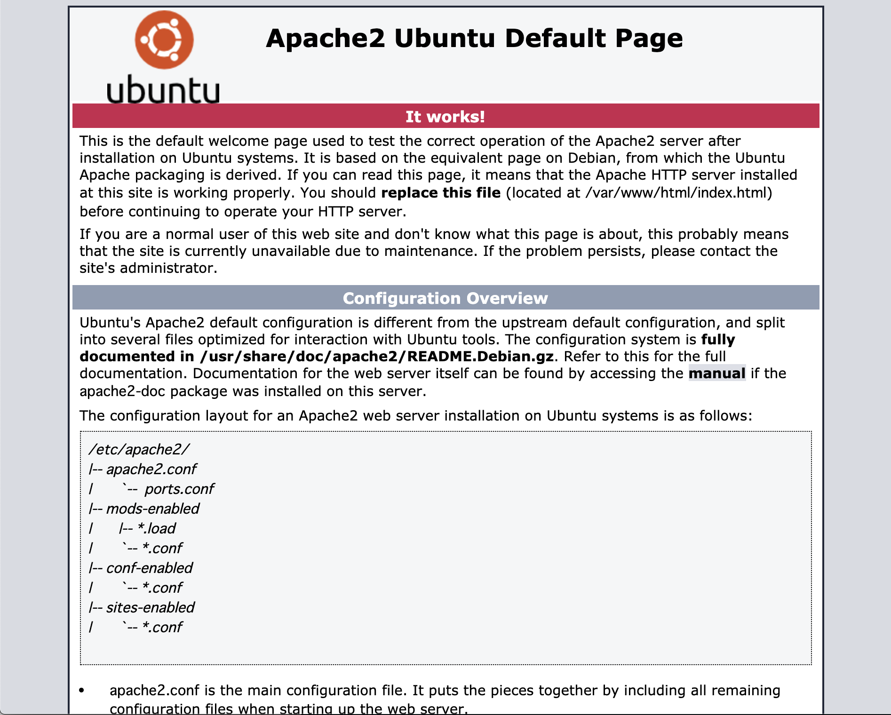

# Apache を触ってみよう

## 事前準備

以下のように`docker pull`をしておいてください。

```bash
docker pull python:buster
```

## Apacheとは

ApacheとはWebサーバソフトウェアの一つで、Nginxと並んで2台勢力を誇っているうちの1つです。
Webサーバソフトウェアとは、HTTPリクエストを受けて何らかのレスポンスを返すソフトウェアのことで、例えばHTMLファイルなどをブラウザに返すなどの役割を持っています。
Webを扱う上でほぼ必ず必要になる、現代に欠かせないソフトウェアです。

### Webサーバソフトウェアのユースケース

ApacheやNginxのユースケースはHTMLなど静的ファイルの配信だけではありません。Webアプリケーションを構成する動的サイトの構築にも利用します。

ApacheやNginxはmodule(プラグイン)という仕組みで、さまざまなソフトウェアと連携させることができます。moduleを使うことで、PHPやPython、Javaなどで構成した動的サイトをApacheから直接動作させることでWebアプリケーションを構成します。

また直接組み込むのではなく、ユーザからのリクエストを受け取ってそのままWebアプリケーションに転送する役割を持たせることも多く行われます。
これはWebアプリケーションを構築するさまざまな言語(Go, Java, Ruby, Python, etc...)で実装されたWebサーバは基本的に管理的な実装になっており、不具合があったり脆弱性に弱かったりするためです。

ApacheやNginxといったWebサーバ専用ソフトウェアは長年バグ修正や脆弱性対応が行われ、高い信頼性を持っているためです。Webサーバは脆弱性をつく攻撃を多く受けるため、前段に信頼性の高いこれらのソフトウェアを起き、後ろにあるWebアプリケーションを保護する役割を持ちます。

そのほかにもroutingやlogging、アクセス管理などWebサーバに求められる機能を提供してくれるのがWebサーバソフトウェアです。

### Apacheの立ち位置

Apacheは「Apacheソフトウェア財団」によって管理されるOSSで、20年以上の歴史を持ちます。
世界的に最も普及したWebサーバで、LAMP(Linux, Apache, MySQL, PHP)環境の一つにも挙げられます。

(最近ではNginxやIISが逆転しつつあるようです => [February 2020 Web Server Survey](https://news.netcraft.com/archives/2020/02/20/february-2020-web-server-survey.html))

信頼性が高く動作も高速で、運用ノウハウも非常に多く手に入れることができます。
そしてmoduleと呼ばれるプラグインの仕組みによってさまざまなソフトウェアと連携することができます。

元々はリクエストごとにプロセスが1つ必要だったため、リクエストが増えた際にプロセスの上限に当たってしまうC10K問題が問題視されましたが、2.4からは`worker`や`evnet`といったプロセス数に依存しない並列処理が可能な機能が実装されています。

## Apacheをインストールして立ち上げる

なにはともあれ動かしてみましょう。今回はubuntuをdockerで立ち上げてその中にApacheをインストールしてみます。

まずは以下のようにdockerコンテナの中に入ります。

```bash
docker run --rm -itd --name test-ubuntu -p 8080:80 -p 8081:81 python:buster /bin/bash
docker exec -it test-ubuntu /bin/bash
```

入れたら`apt install`を使ってApacheをインストールしてみましょう。

```bash
root@0094fde0c301:/# apt update
Get:1 http://security.ubuntu.com/ubuntu focal-security InRelease [107 kB]
Get:2 http://security.ubuntu.com/ubuntu focal-security/restricted amd64 Packages [4673 B]
Get:3 http://security.ubuntu.com/ubuntu focal-security/main amd64 Packages [60.9 kB]
Get:4 http://security.ubuntu.com/ubuntu focal-security/universe amd64 Packages [8273 B]
~~~略~~~

root@0094fde0c301:/# apt install -y apache2 apache2-dev vim
Reading package lists... Done
Building dependency tree
Reading state information... Done
~~~略~~~
Updating certificates in /etc/ssl/certs...
0 added, 0 removed; done.
Running hooks in /etc/ca-certificates/update.d...
done.
root@0094fde0c301:/#
```

途中でtimezoneなどを聞かれたら`Asia`や`Tokyo`を選んでください。以下のようにバージョンを表示できれば成功です。

```shell
root@eafdc5e6de33:/# apache2 -v
Server version: Apache/2.4.38 (Debian)
Server built:   2019-10-15T19:53:42
```

以下のようにApacheを起動してください。

```shell
service apache2 start
```

ブラウザを開いて`localhost:8080`にアクセスしてみてください。以下のような画面が表示されれば成功です。



## HTMLファイルの配信 (check1)

表示されたページはデフォルトのHTMLファイルです。これを自分で作成したページに置き換えてみます。
デフォルトではDocument Rootは`/var/www/html/`に設定されています。

::: tip
Document RootはApacheが静的ファイルを配信するためのroot directryです。
:::

この下にある`index.html`ファイルを自分の物に置き換えてみましょう。

```sh
cd /var/www/html/
mv index.html _index.html
echo 'Hello Bootcamp!!' > index.html
```

再び`http://localhost:8080/`を開くと`Hello Bootcamp!!`が表示されるのを確認してください。

::: tip
`http://localhost:8080/` のようにファイル名を指定せずディレクトリ（この場合はルートディレクトリ）を指定した場合、Apacheは`index.html`を返すようにデフォルトで設定されています。
この設定は変更できます。
:::

Document root配下にディレクトリを作成するとブラウザからも同様にアクセスできます。

```sh
mkdir /var/www/html/hoge
echo 'Hello HUGA!!' > /var/www/html/hoge/huga.txt
```

`http://localhost:8080/hoge/huga.txt` にアクセスすると追加したファイルが表示されます。

## VirtualHost の設定

1つのApacheで複数のWebサイトを管理したいことがあります。異なるIPアドレスやアドレス、port番号からアクセスされた時にDocument Rootなどを切り替えたいときは`VirtualHost`を設定することで実現できます。

ここではport番号を`80`と`81`に分けて別々のWebサイトを設定してみます。
(docker起動時にport forwardしているため、手元からは`8080`と`8081`からアクセスできます。)

まずは新しくDocument RootになるディレクトリとHTMLファイルを作成します。

```sh
mkdir /var/www/html/site-80
mkdir /var/www/html/site-81
echo 'This is site 80!' > /var/www/html/site-80/index.html
echo 'This is site 81!' > /var/www/html/site-81/index.html
```

次にApacheの設定をして行きます。やることは

- listen portに81を追加
- virtual host設定の追加

の2つです。listen portの追加は`/etc/apache2/ports.conf`に書きましょう。
以下のように`Listen 81`の記述を追加します。

```apache
# If you just change the port or add more ports here, you will likely also
# have to change the VirtualHost statement in
# /etc/apache2/sites-enabled/000-default.conf

Listen 80
Listen 81

<IfModule ssl_module>
        Listen 443
</IfModule>

<IfModule mod_gnutls.c>
        Listen 443
</IfModule>

# vim: syntax=apache ts=4 sw=4 sts=4 sr noet
```

VitrualHostの設定は`/etc/apache2/sites-available`の下に作成して行きます。

`/etc/apache2/sites-available/site-80.conf`

```xml
<VirtualHost *:80>
  DocumentRoot /var/www/html/site-80
</VirtualHost>
```

`/etc/apache2/sites-available/site-81.conf`

```xml
<VirtualHost *:81>
  DocumentRoot /var/www/html/site-81
</VirtualHost>
```

設定ファイルを作成したら`a2dissite`、`a2ensite`コマンドを使って設定を有効化しましょう。

```sh
a2dissite 000-default
a2ensite site-80
a2ensite site-81
```

そしてApacheをリスタートします。

```sh
service apache2 reload
```

`localhost:8080`と`localhost:8081`にアクセスしてみてください。意図通りの挙動になっているでしょうか。

|  |
| ------------------------------- |

|  |
| ------------------------------- |

## Basic 認証をかけてみる(check2)

特定ディレクトリにアクセスできる人を制限するために、Basic認証をかけてみましょう。
Basic認証用のmoduleが既にインストールされているはずなので、有効化します。

```sh
a2enmod auth_basic
```

まずはパスワードが記載された`.htpasswd`ファイルを作成します。

```sh
mkdir /etc/apache2/auth/
htpasswd -c /etc/apache2/auth/.htpasswd admin
```

`admin`がユーザ名になります。パスワードの入力を求められるので、適当に設定してください。

次に`/etc/apache2/sites-available/site-81.conf`を以下のように編集します。

```xml
<VirtualHost *:81>
  DocumentRoot /var/www/html/site-81
  <Directory "/var/www/html/site-81">
    AuthUserFile /etc/apache2/auth/.htpasswd
    AuthName "site-81 Authorization"
    AuthType Basic
    Require valid-user
  </Directory>
</VirtualHost>
```

ファイルを編集したら`service apache2 restart`で再起動しましょう。`localhost:8081`にアクセスしてみてください。パスワードが求められ、先ほど入力した認証情報を入れないとアクセスできなくなっているはずです。

## Pythonアプリを動かしてみよう(check3)

ここまではVirtualHostでリソースを管理しつつ、静的なファイルを配信する設定を作ってきました。この章では別のユースケースとして、Pythonで書かれたWebアプリをApache経由で動かす設定を作ってみます。

このdocker imageには既にpythonがインストールされています。

```sh
# python --version
Python 3.8.2
```

Pythonで作成したWebアプリをApacheなどから実行する場合、[WSGI](https://ja.wikipedia.org/wiki/Web_Server_Gateway_Interface)というインタフェース定義に従ってWebアプリを作成します。
これはPython側のインタフェースを規定することで、他のプログラム(今回の場合Apache)から呼び出しやすくする物です。

あとでやるDjangoなど主要なPythonフレームワークはこのAPIに従っているため、Djangoで作成したアプリは今回と同じ手順でApacheから実行することができます。

以下のようなPythonコードを`/var/www/html/site-80`以下に置いておきましょう。

`vim /var/www/html/site-80/app.py`

```python
def application(environ, start_response):
    status = '200 OK'
    output = b'Hello! This is python application!'

    response_headers = [('Content-type', 'text/plain'),
                        ('Content-Length', str(len(output)))]
    start_response(status, response_headers)
    return [output]
```

次にwsgiを動かすためのApache moduleをインストールします。

```sh
# pip install mod-wsgi
Collecting mod-wsgi
  Using cached mod_wsgi-4.7.1.tar.gz (498 kB)
Building wheels for collected packages: mod-wsgi
  Building wheel for mod-wsgi (setup.py) ... done
  Created wheel for mod-wsgi: filename=mod_wsgi-4.7.1-cp38-cp38-linux_x86_64.whl size=809821 sha256=570b19e67813e819f04ee00006b5c556339e37a03dea4af0021837b098588c0d
  Stored in directory: /root/.cache/pip/wheels/e9/82/71/1b42d6274a24af477453cecc993213fc8abd15433d80b01e93
Successfully built mod-wsgi
Installing collected packages: mod-wsgi
Successfully installed mod-wsgi-4.7.1
```

インストールすると以下のディレクトリにsoファイルが生成されています。Apacheに読み込ませる必要があるため確認しておきましょう。

```sh
ls /usr/local/lib/python3.8/site-packages/mod_wsgi/server/mod_wsgi-py38.cpython-38-x86_64-linux-gnu.so
```

このファイルを読み込むように、`vim /etc/apache2/mods-available/wsgi.load`を以下のように作成します。

```xml
LoadModule wsgi_module /usr/local/lib/python3.8/site-packages/mod_wsgi/server/mod_wsgi-py38.cpython-38-x86_64-linux-gnu.so
```

moduleを有効化しておきます。

```sh
a2enmod wsgi
```

準備が整ったのでsite-80に先ほどのPythonアプリケーションを読み込ませましょう。
`vim /etc/apache2/sites-available/site-80.conf`

```xml
<VirtualHost *:80>
  DocumentRoot /var/www/html/site-80
  WSGIScriptAlias /app /var/www/html/site-80/app.py
</VirtualHost>
```

最後にApacheをリスタートします。

```sh
service apache2 restart
```

`http://localhost:8080/app` にアクセスしてみてください。`Hello! This is python application!` が表示されるでしょうか。

うまくいったら`app.py`を適当に変更して、Pythonが動的に実行されているのを確認してください。
